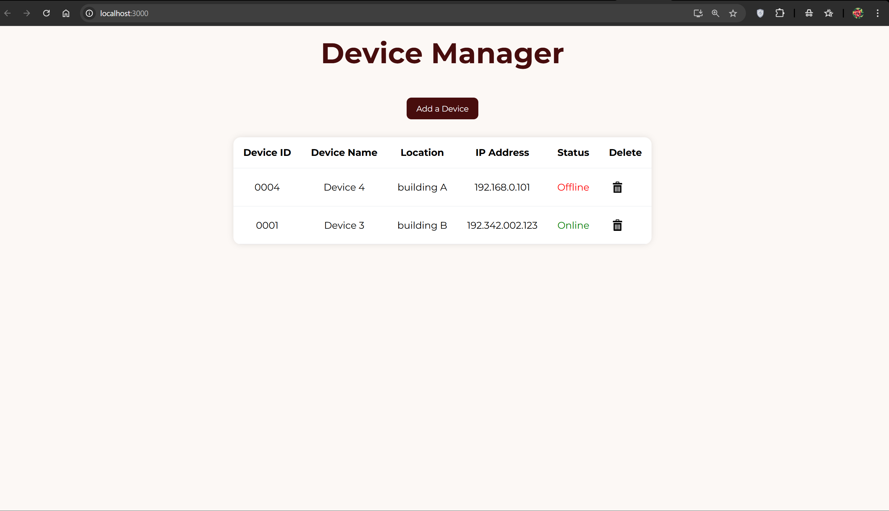
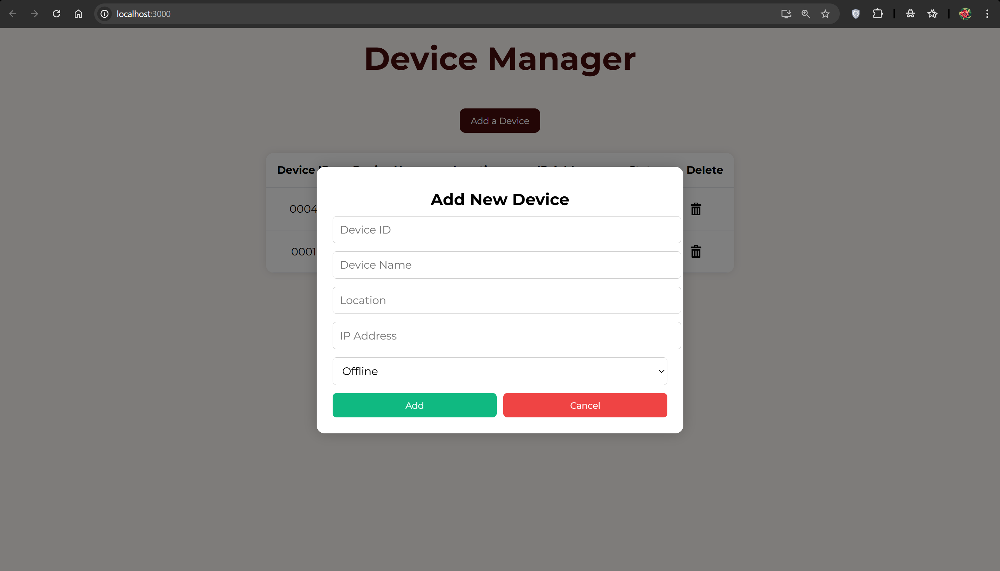

# ⚙️ CondorAI - Device Management Dashboard

A simple yet powerful web application to **add, monitor, update, and delete edge devices** using a FastAPI backend and a React frontend.

---

## 📦 Installation & Setup

### Backend (FastAPI + Uvicorn)

1. **Navigate to the backend folder:**

```bash
cd backend
```

2. **Create a virtual environment (recommended):**

```bash
python -m venv venv
source venv/bin/activate  # On Windows: venv\Scripts\activate
```
3. **Install dependencies:**

```bash
pip install fastapi uvicorn
```
4. **Run the backend server:**

```bash
uvicorn main:app --reload
```
By default, the backend runs on http://localhost:8000.

### Frontend (React)
1. **Navigate to the frontend folder (where your React app lives):**

```bash
cd condorai
```

2. **Install node dependencies:**

```bash
npm install
```

3. **Run the React development server:**

```bash
npm start
```
The frontend should now be live at http://localhost:3000.

---
## Screenshots

### Device Dashboard


### Add Device Form


---

## Tech Stack

| Tool        | Purpose                            |
|-------------|------------------------------------|
| **React.js** | Frontend UI                       |
| **Tailwind CSS** | Styling and responsiveness    |
| **FastAPI**  | Backend REST API                  |
| **Uvicorn**  | ASGI server to run FastAPI        |
| **Axios**    | HTTP communication                |
| **Pydantic** | Backend data validation           |
| **CORS Middleware** | Handle cross-origin access |
| **React Icons** | Beautiful icon components      |

---

## Features
- Add new devices
- Toggle device status between Online and Offline
- Delete devices
- Clean UI with styled components
- Popup form to add devices
- Device list with status-based actions

---
Built by Mythri & Saranya
